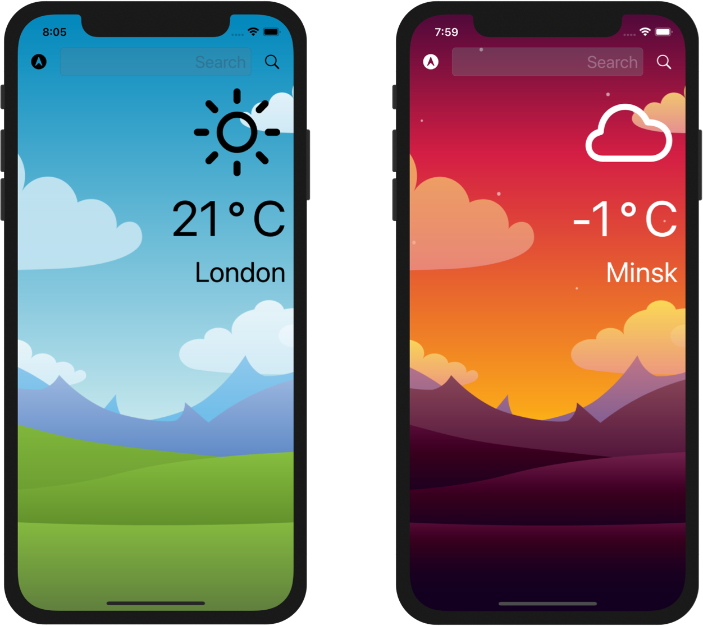

# Weather

Weather is a beautiful, dark-mode enable app to check the weather for the current location based on the GPS data from the iPhone as well as by searching for a city manually.

## Screenshots



## Requirements

- macOS 11.0.1 or later
- Xcode 12.0 or later
- iOS 14.0 or later. iPad devices are not supported

#### How to set up the environment

1. Upgrade macOS to the latest version.
2. Upgrade or install Xcode to the latest version.
3. Install [Homebrew](https://brew.sh).
4. Install [Git](https://git-scm.com/download/mac) via Homebrew.

#### How to build the app

1. Clone the repository
```bash
git clone https://github.com/AndreyKovalevskiy/Weather.git
```
2. Open the `Weather.xcodeproj` file from the `Weather` folder
3. [Run the app in the Simulator or on a Device](https://developer.apple.com/documentation/xcode/running_your_app_in_the_simulator_or_on_a_device)
- Choose a Scheme - `Weather`
- Select a simulated or real iOS device
- Run the App by clicking the `Run` button
4. Enjoy it.

## License
[MIT](https://choosealicense.com/licenses/mit/)
